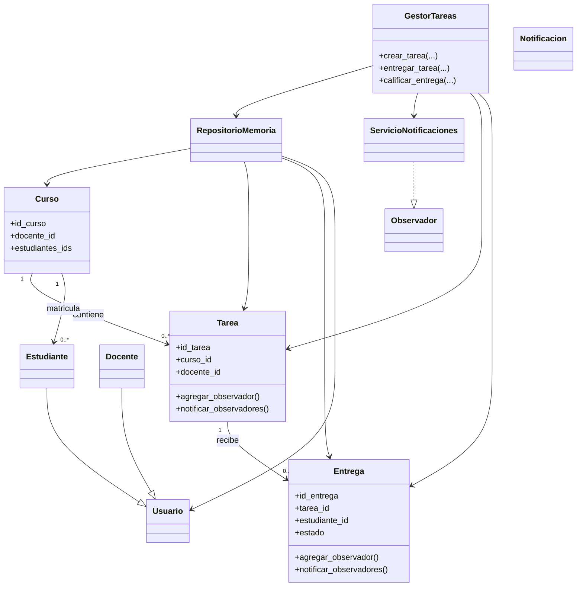
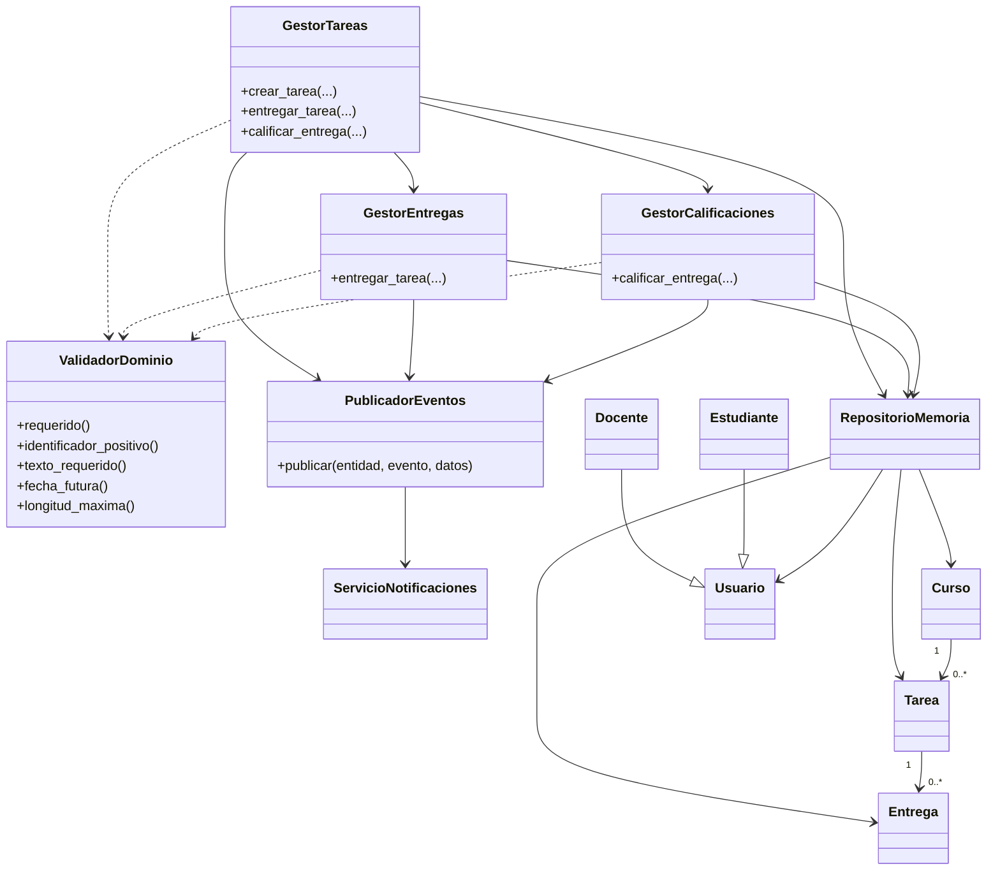
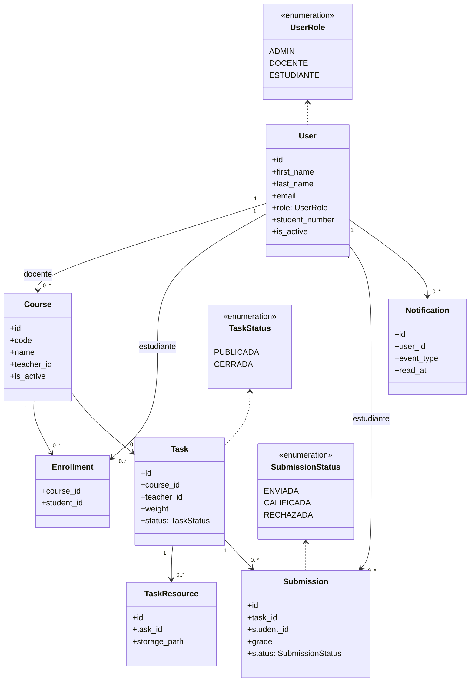

# Informe Final Fase 3 - UeesTask

## 1. Portada textual
- Proyecto: UeesTask - Plataforma de seguimiento de tareas academicas con notificaciones
- Dominio: D4
- Universidad: Universidad de Especialidades Espiritu Santo
- Asignatura: Diseno de Software (UCOM0310)
- Docente: Victoria Garcia Velasquez, MGP.
- Autores:
  - ALEXIS OMAR ANALUISA JARAMILLO
  - JOSELINE NATHALY DUARTE LEON
  - WILLIAM ADRIAN CABRERA MALDONADO
  - OSCAR ANDRES BERNAL RODRIGUEZ
- Periodo: Segundo parcial, julio de 2026
- Repositorio: https://github.com/oscarandresbro40/UeesTask-Fase2

## 2. Resumen ejecutivo
UeesTask se desarrollo para gestionar tareas academicas, entregas, calificaciones y notificaciones dentro de cursos universitarios. La linea base de Fase 2 concentro logica clave en una clase principal, lo que facilito detectar malos olores y priorizar una estrategia incremental de refactorizacion. Entre los tags fase2-final y fase3-refactor-domain se aplicaron seis refactorizaciones con pruebas en verde antes y despues en cada paso. Esa red de seguridad permitio evolucionar luego hacia una aplicacion web con FastAPI, persistencia SQLAlchemy sobre PostgreSQL y nuevas capacidades funcionales. El estado actual mantiene trazabilidad Git completa y 32 pruebas en verde.

## 3. Repositorio y trazabilidad
- URL: https://github.com/oscarandresbro40/UeesTask-Fase2
- Rama principal historica: main
- Rama de trabajo actual: feature/fase3-web
- Otras ramas relevantes: refactor/fase3-domain
- Tags relevantes:
  - fase2-final: linea base previa a las seis refactorizaciones.
  - fase3-refactor-domain: cierre del ciclo academico de seis refactorizaciones.

Checkpoint por etapa:
- fase2-final: estado del dominio previo al refactor.
- fase3-refactor-domain: estado posterior al refactor del dominio.
- feature/fase3-web: migracion arquitectonica y crecimiento funcional web.

## 4. Linea base de Fase 2
- Commit de referencia: f456dee
- Tag: fase2-final
- Pruebas registradas en checkpoint: 19 passed
- Casos de uso operativos en evidencia: CU-04, CU-07, CU-08
- Punto central del diagnostico: clase GestorTareas en app/services/gestor_tareas.py (checkpoint fase2-final)

## 5. Diagnostico de malos olores
Malos olores identificados en el checkpoint fase2-final:
- Long Method
- Duplicate Code
- Large Class
- Magic Numbers
- Mixed Responsibilities

Las ubicaciones exactas de ese diagnostico pertenecen al checkpoint fase2-final y a sus evidencias historicas. El arbol actual evoluciono despues hacia una aplicacion web.

## 6. Metodologia de refactorizacion
Ciclo aplicado por iteracion:
1. pruebas en verde
2. cambio pequeno
3. pruebas en verde
4. evidencia
5. commit

Las seis refactorizaciones quedaron acotadas entre fase2-final y fase3-refactor-domain.

## 7. Matriz de las seis refactorizaciones

| Numero | Tecnica | Mal olor atendido | Nivel | Archivos/componentes | Commit | Evidencia | Pruebas antes | Pruebas despues | Resultado |
|---|---|---|---|---|---|---|---|---|---|
| 1 | Extract Method | Long Method, Mixed Responsibilities | Metodos | app/services/gestor_tareas.py | 1a6d0f7 | docs/evidencias_pruebas/01_extract_method.txt | 19 passed | 19 passed | Estable |
| 2 | Extract Class | Large Class, Mixed Responsibilities | Clases y objetos | app/services/gestor_tareas.py, app/services/gestor_entregas.py, app/services/gestor_calificaciones.py | bca7dd9 | docs/evidencias_pruebas/02_extract_class.txt | 19 passed | 19 passed | Estable |
| 3 | Replace Magic Number with Symbolic Constant | Magic Numbers | Datos | app/services/gestor_tareas.py, app/services/gestor_calificaciones.py, app/utils/constantes.py | 73ecab9 | docs/evidencias_pruebas/03_replace_magic_numbers.txt | 19 passed | 19 passed | Estable |
| 4 | Consolidate Conditional Expression | Validacion fragmentada de rango de nota | Condicionales | app/services/gestor_calificaciones.py | a9ce962 | docs/evidencias_pruebas/04_consolidate_conditional.txt | 19 passed | 19 passed | Estable |
| 5 | Extract Validator | Duplicate Code en validaciones | Metodos + clases/objetos | app/utils/validador_dominio.py, app/services/* | bdbcbb1 | docs/evidencias_pruebas/05_extract_validator.txt | 19 passed | 19 passed | Estable |
| 6 | Move Method | Mixed Responsibilities en publicacion de eventos | Clases y objetos | app/notifications/publicador_eventos.py, app/services/* | a847c74 | docs/evidencias_pruebas/06_move_method_publicador.txt | 19 passed | 19 passed | Estable |

## 8. Desarrollo detallado de cada refactorizacion
### 8.1 Refactorizacion 1 - Extract Method (1a6d0f7)
- Situacion anterior: GestorTareas acumulaba validaciones, persistencia y notificacion en bloques extensos.
- Mal olor: Long Method con responsabilidades mezcladas.
- Tecnica aplicada: Extract Method.
- Cambio realizado: separacion de pasos internos de creacion/validacion en metodos auxiliares dentro del servicio.
- Situacion posterior: flujo mas legible y menor complejidad por metodo.
- Cohesion/acoplamiento: mejora de cohesion local de metodos, sin cambiar contratos externos.
- Archivos involucrados: app/services/gestor_tareas.py.
- Evidencia de pruebas: docs/evidencias_pruebas/01_extract_method.txt (19 passed antes y despues).
- Nivel: metodos, por descomposicion de operaciones internas.

### 8.2 Refactorizacion 2 - Extract Class (bca7dd9)
- Situacion anterior: GestorTareas concentraba CU-04, CU-07 y CU-08.
- Mal olor: Large Class y Mixed Responsibilities.
- Tecnica aplicada: Extract Class.
- Cambio realizado: creacion de GestorEntregas y GestorCalificaciones.
- Situacion posterior: GestorTareas delega CU-07 y CU-08.
- Cohesion/acoplamiento: mayor cohesion por caso de uso y menor acoplamiento funcional interno.
- Archivos involucrados: app/services/gestor_tareas.py, app/services/gestor_entregas.py, app/services/gestor_calificaciones.py.
- Evidencia de pruebas: docs/evidencias_pruebas/02_extract_class.txt (19 passed antes y despues).
- Nivel: clases y objetos, por rediseno de responsabilidades.

### 8.3 Refactorizacion 3 - Replace Magic Number with Symbolic Constant (73ecab9)
- Situacion anterior: limites de ponderacion, nota y longitud estaban hardcodeados.
- Mal olor: Magic Numbers.
- Tecnica aplicada: Replace Magic Number with Symbolic Constant.
- Cambio realizado: extraccion de constantes de dominio en app/utils/constantes.py.
- Situacion posterior: reglas numericas centralizadas y mas mantenibles.
- Cohesion/acoplamiento: mejora consistencia de datos de negocio compartidos.
- Archivos involucrados: app/services/gestor_tareas.py, app/services/gestor_calificaciones.py, app/utils/constantes.py.
- Evidencia de pruebas: docs/evidencias_pruebas/03_replace_magic_numbers.txt (19 passed antes y despues).
- Nivel: datos, por centralizacion de valores simbolicos.

### 8.4 Refactorizacion 4 - Consolidate Conditional Expression (a9ce962)
- Situacion anterior: validacion de nota dividida en condicionales separados.
- Mal olor: decision de invalidez fragmentada.
- Tecnica aplicada: Consolidate Conditional Expression.
- Cambio realizado: expresion unica de nota invalida y seleccion de mensaje conservando semantica.
- Situacion posterior: validacion mas clara y sin alterar comportamiento.
- Cohesion/acoplamiento: mejora lectura de reglas de control.
- Archivos involucrados: app/services/gestor_calificaciones.py.
- Evidencia de pruebas: docs/evidencias_pruebas/04_consolidate_conditional.txt (19 passed antes y despues).
- Nivel: condicionales.

### 8.5 Refactorizacion 5 - Extract Validator (bdbcbb1)
- Situacion anterior: validaciones repetidas en varios servicios.
- Mal olor: Duplicate Code.
- Tecnica aplicada: Extract Validator.
- Cambio realizado: creacion de ValidadorDominio con metodos reutilizables.
- Situacion posterior: validaciones comunes centralizadas.
- Cohesion/acoplamiento: menor duplicacion y frontera clara de reglas basicas.
- Archivos involucrados: app/utils/validador_dominio.py, app/services/gestor_tareas.py, app/services/gestor_entregas.py, app/services/gestor_calificaciones.py.
- Evidencia de pruebas: docs/evidencias_pruebas/05_extract_validator.txt (19 passed antes y despues).
- Nivel: metodos y clases/objetos.

### 8.6 Refactorizacion 6 - Move Method (a847c74)
- Situacion anterior: los servicios invocaban directamente operaciones Observer en entidades.
- Mal olor: Mixed Responsibilities.
- Tecnica aplicada: Move Method (encapsulacion de publicacion).
- Cambio realizado: creacion de PublicadorEventos y delegacion desde servicios.
- Situacion posterior: publicacion de eventos centralizada.
- Cohesion/acoplamiento: menor acoplamiento entre casos de uso y mecanismo Observer.
- Archivos involucrados: app/notifications/publicador_eventos.py y servicios de dominio.
- Evidencia de pruebas: docs/evidencias_pruebas/06_move_method_publicador.txt (19 passed antes y despues).
- Nivel: clases y objetos.

## 9. Cobertura de los cuatro niveles

| Nivel | Refactorizaciones asociadas | Evidencia |
|---|---|---|
| Metodos | 1 (Extract Method), 5 (Extract Validator) | 01, 05 |
| Clases y objetos | 2 (Extract Class), 6 (Move Method) | 02, 06 |
| Datos | 3 (Replace Magic Number with Symbolic Constant) | 03 |
| Condicionales | 4 (Consolidate Conditional Expression) | 04 |

## 10. Evolucion del diagrama de clases
### Diagrama A - Antes de refactorizar (checkpoint fase2-final)

Figura 1. Diagrama de clases antes de refactorizar.
Checkpoint: fase2-final.
Fuente: elaboracion propia a partir del codigo del repositorio.

### Diagrama B - Despues de las seis refactorizaciones (checkpoint fase3-refactor-domain)

Figura 2. Diagrama de clases despues de las seis refactorizaciones.
Checkpoint: fase3-refactor-domain.
Fuente: elaboracion propia a partir del codigo del repositorio.

### Diagrama C - Modelo final de la aplicacion web (HEAD actual)

Figura 3. Diagrama de clases del modelo final web.
Checkpoint: HEAD actual (feature/fase3-web).
Fuente: elaboracion propia a partir del codigo del repositorio.

## 11. Explicacion de la evolucion del diseno
La evolucion elimina el cuello de botella de GestorTareas como clase concentradora. Primero se descompone logica de metodos extensos y se separan responsabilidades en GestorEntregas y GestorCalificaciones. Luego se centralizan validaciones comunes en ValidadorDominio, se sustituyen numeros magicos por constantes y se consolida la validacion condicional de nota. La publicacion de eventos Observer se encapsula en PublicadorEventos, reduciendo dependencias cruzadas en servicios. Finalmente, la aplicacion migra a entidades persistentes SQLAlchemy y rutas FastAPI, conservando trazabilidad historica en Git.

## 12. Evolucion funcional posterior
Commits posteriores al checkpoint refactorizado:
- d37e141 - migracion base a FastAPI y PostgreSQL.
- 1893a7a - autenticacion y paneles.
- c1fbdf3 - flujos academicos.
- dd8e689 - gestion avanzada.
- 1b9b9be - reglas academicas.
- 7e0a605 - datos demostrativos.
- e3b0e86 - instalador para Windows.

Estos commits corresponden a migracion arquitectonica, funcionalidad, datos, distribucion y documentacion. No se contabilizan como parte de las seis refactorizaciones academicas.

## 13. Pruebas y calidad
- Linea base: 19 pruebas.
- Ciclo de seis refactorizaciones: 19 passed antes y despues en evidencias 01 a 06.
- Crecimiento posterior por migracion y nuevas funciones.
- Estado actual: 32 passed.
- Herramienta: pytest.
- Advertencia deprecada de TestClient: aceptada, no se considera fallo.
- Evidencias acumuladas: 01 a 13.

## 14. Arquitectura final
Arquitectura web local basada en FastAPI con capas por modulos:
- API y vistas: app/web.py, app/uees.py, app/full.py, app/advanced.py, app/final.py.
- Persistencia: SQLAlchemy ORM y sesiones en app/database.py.
- Base de datos: PostgreSQL (contenedor Docker Compose).
- Migraciones: Alembic.
- Presentacion: Jinja2 y archivos estaticos.
- Seguridad local: hash/verificacion de contrasena y middleware de sesion.
- Dominio: reglas operativas en app/services.py y regla academica en listener before_flush (app/final.py).
- Distribucion local: scripts de instalacion para Windows.

No se declara arquitectura lista para produccion.

## 15. Principios y patrones
Componentes respaldados por codigo:
- Responsabilidad unica y separacion de responsabilidades en el checkpoint refactorizado (GestorTareas, GestorEntregas, GestorCalificaciones).
- Observer en checkpoint refactorizado (observer.py, servicio_notificaciones.py, publicador_eventos.py).
- Repository en checkpoint refactorizado (repositorio_memoria.py).
- Servicios de dominio en checkpoints y en app/services.py de la aplicacion web.
- Inyeccion de dependencias comprobable en FastAPI mediante Depends(get_db).
- Evento/listener SQLAlchemy before_flush en app/final.py para reglas academicas.

Se diferencia el patronado del checkpoint refactorizado de los componentes de la aplicacion web actual.

## 16. Limitaciones
- Proyecto academico.
- Credenciales demostrativas.
- Ejecucion local.
- PostgreSQL mediante Docker.
- Sin validacion de despliegue en produccion.
- Advertencia de deprecacion de TestClient pendiente de actualizacion.
- Historial de refactorizacion preservado en Git aunque el arbol actual evoluciono a web.

## 17. Conclusiones
La Fase 3 mejora mantenibilidad y claridad del sistema mediante una secuencia trazable de seis refactorizaciones, con impacto positivo en cohesion y reduccion de duplicacion. El control de reglas quedo mas explicito, y la evolucion posterior a FastAPI + SQLAlchemy amplio cobertura funcional sin perder evidencia historica. La combinacion de pruebas automatizadas y checkpoints Git permite defender el cumplimiento de los cuatro niveles de refactorizacion (metodos, clases/objetos, datos y condicionales) y el estado actual de 32 pruebas en verde.

## 18. Apendice de evidencia

| Evidencia | Archivo | Commit | Proposito | Resultado de pruebas |
|---|---|---|---|---|
| 01 | docs/evidencias_pruebas/01_extract_method.txt | 1a6d0f7 | Extract Method en gestor_tareas | 19 passed antes/despues |
| 02 | docs/evidencias_pruebas/02_extract_class.txt | bca7dd9 | Extract Class en servicios de dominio | 19 passed antes/despues |
| 03 | docs/evidencias_pruebas/03_replace_magic_numbers.txt | 73ecab9 | Constantes simbolicas de dominio | 19 passed antes/despues |
| 04 | docs/evidencias_pruebas/04_consolidate_conditional.txt | a9ce962 | Consolidacion de validacion de nota | 19 passed antes/despues |
| 05 | docs/evidencias_pruebas/05_extract_validator.txt | bdbcbb1 | ValidadorDominio compartido | 19 passed antes/despues |
| 06 | docs/evidencias_pruebas/06_move_method_publicador.txt | a847c74 | PublicadorEventos y encapsulacion observer | 19 passed antes/despues |
| 07 | docs/evidencias_pruebas/07_migracion_base_web.txt | d37e141 | Migracion base web FastAPI + PostgreSQL | ver evidencia |
| 08 | docs/evidencias_pruebas/08_autenticacion_paneles.txt | 1893a7a | Autenticacion y paneles por rol | ver evidencia |
| 09 | docs/evidencias_pruebas/09_flujos_academicos_web.txt | c1fbdf3 | Flujos academicos web | ver evidencia |
| 10 | docs/evidencias_pruebas/10_gestion_avanzada.txt | dd8e689 | Gestion avanzada | 31 passed |
| 11 | docs/evidencias_pruebas/11_reglas_academicas_finales.txt | 1b9b9be | Reglas academicas finales | 32 passed |
| 12 | docs/evidencias_pruebas/12_datos_demostracion.txt | 7e0a605 | Seeds y dump reproducible | 32 passed |
| 13 | docs/evidencias_pruebas/13_instalador_windows.txt | e3b0e86 | Instalador y manuales Windows | 32 passed |
| 14 | docs/evidencias_pruebas/14_documentacion_final.txt | pendiente | Cierre tecnico y trazabilidad Fase 3 | 32 passed |
